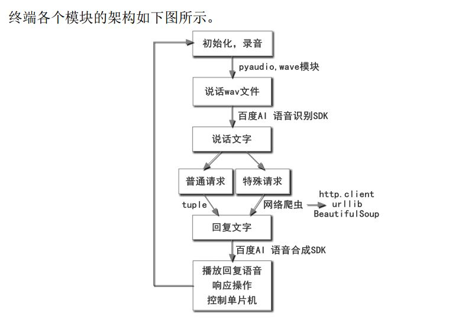
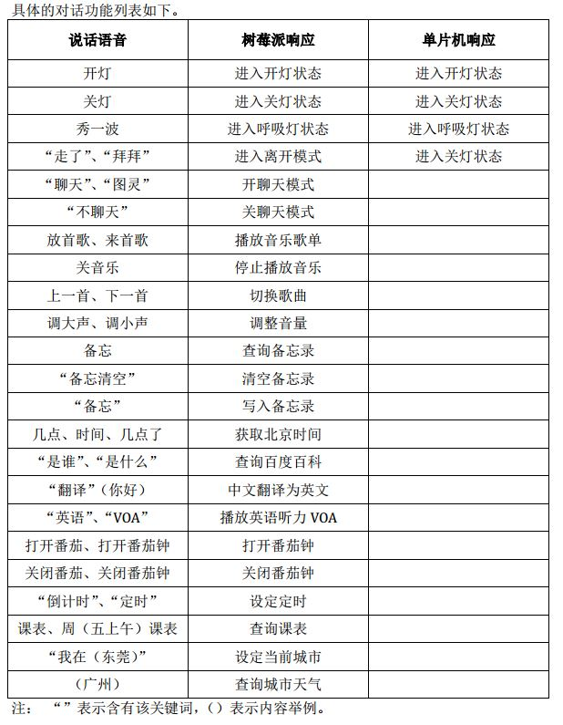

## AILP (Pi src) 工程说明


### 工程信息
- 名称：AI Learning Partner (Pi terminal source) / 智能学习伴侣（树莓派端源代码）
- 作者：Shallwe
- 日期：2018/08/20
- 当前版本：v1.1.0

- - - - - - -  
### 相关说明
- 2018广东省电子设计竞赛作品树莓派端源码。安卓端和单片机端暂不公布。
- **此工程没有办法直接运行**，需要安装各种依赖（如百度AI的SDK等），而且树莓派与单片机要有相应的GPIO和串口连接，所以源代码仅作为分享。
- 转载请注明原作者。
- 工程撰写时可能会有点乱，请见谅。

- - - - - - -  
### 工程简介
- 主文件为`AILP_main.py`，使用以下命令运行。  
    ```  
    python AILP_main.py  
    ```  
- 工程会在三个关键文件的函数中循环执行任务。其它文件只是一些子函数。循环过程如下。
    - 1. `hardware_func.py`主要是控制与单片机的相关硬件接口。
    - 2. `wav_func.py`主要是处理麦克风的声音。
    - 3. `ai_func.py`主要对读取到的声音文件进行语音识别、语音合成和相应功能反馈。其间会调用其它相关文件。

- - - - - - -  
### 功能介绍
- 树莓派端框架。树莓派端可借助百度AI的API，实现语音识别和语音合成，完成一定任务。  
      
- 语音部分整体实现功能。  
      

- - - - - - -  
### LICENSE
- [Apache License 2.0](./LICENSE)  
